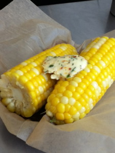

# 3pm means corn on the cob

This is a recipe that Rolando came up with two years ago. It's really simple. As long as the corn is local and sweet, it's hard to go wrong. The key is cooking the corn quickly so it's not starchy or mushy. We've got it down to a science. Drop the corn in simmering water for 1 minute and 15 seconds, season it with a little salt and top it with lime-cilantro butter.

This will be at all locations at 3pm today and through the end of next week. If you want to make the compound butter at home, here's the recipe:

Lime-Cilantro Butter

1 pound butter, softened  
Juice of 2 limes  
1 bunch cilantro, chopped  
1 tablespoon Aleppo pepper

Using a stand mixer or a large spoon, beat butter, lime juice, and Aleppo pepper till smooth and well combined. Refrigerate.

Copyright 2010, Clover Fast Food
