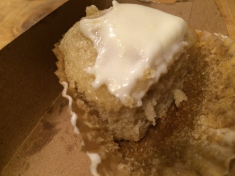

# Always ugly

It's no secret we don't do much sweet at Clover.

Why? It's pretty personal. I'm not in this business to douse you with baked goods. There aren't many people who benefit from that afternoon cookie, or the dessert at lunch.

But that doesn't mean we don't like sweets. We just don't want them to become a daily addiction for our customers. So we do sweets occasionally. If you haven't had the opportunity to try our cupcakes (or donuts) keep an eye on the twitter feed. These are typically spontaneous happenings. They're always ugly. And really really delicious.

This cupcake was one made by Michael T. at Harvard Square. I helped a bit. It's a vanilla cupcake with a rum frosting. Not just any run, Mount Gay. It was Tracy's birthday, so we made up 150 or so and gave them away to customers, which is a longtime Clover tradition. Tracy is from Barbados and loves rum.

Yay yay!
