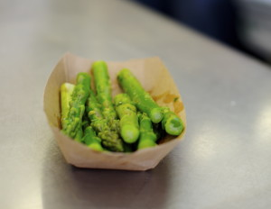

# At 3pm Clover is the asparagus capital of the world

Today we launch asparagus with lemon as the 3pm special. The asparagus is from the Pioneer Valley, which Ayr claims is the Asparagus capital of the world. He might have some bias there… and Julian (PRK truck manager) who's from Germany says his country is rightfully the asparagus capital of the world.

Come on out at 3pm for these. If you're not near enough to come out and sample, [you can watch Rolando's demo](http://www.youtube.com/watch?v=M7g98Ulzbo8). This is part of a series of training videos we're building for all 3pm specials.
