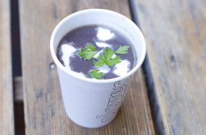

# Chilled black bean soup

Chris used to live in Florida, where he fell in love with Cuban black beans and rice. He came up with this chilled black bean soup. We're going to run it tomorrow at lunch. This soup makes use of one of our rare by-products, the tomato water left when we chop tomatoes for our cucumber-tomato salad. When you make it at home, you can use stock instead. You'll want to scale down the recipe; this one makes 50 10-oz portions.

CHILLED BLACK BEAN SOUP

3.5 quarts dry black beans  
1 red onion  
1 jalapeno  
1 clove garlic  
2 plum tomatoes  
4 quarts tomato juice (or stock)  
red wine vinegar, to taste  
sugar, to taste  
salt, to taste  
cilantro, for garnish  
sour cream, for garnish

1\. Put black beans in an 8qt container, and fill with cold water. Soak, refrigerated, for 12-24 hours.  
2\. Drain and rinse soaked black beans. Place beans in a large pot and add water to cover.  
3\. Simmer for 45 minutes to 1 hour, until soft.  
4\. Remove from heat and cool beans and cooking liquid.  
5\. Blend red onion, jalapeno, garlic, tomatoes, and tomato juice or stock together, including cooking liquid, until smooth. Season with salt, vinegar and sugar to taste.  
6\. Ladle soup into a 12-oz cup or bowl. Separate cilantro leaves from stem and put one or two leaves on top of soup.  
7\. Add water to the sour cream, and whip with a spoon or whisk until it is thin enough to drizzle, and sits on top of soup without sinking.

Copyright 2013, Clover Fast Food
