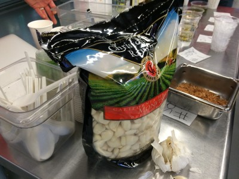

# China Fresh

Just about everybody who works in the kitchen has beef with me. A long time ago I decided Clover would use fresh garlic. We'd started out that way. But then I think Rolando had brought in an already peeled product, which is really popular in kitchens. And I thought the hummus was off and couldn't figure out why until I tracked this down. So we went to exclusively fresh garlic.

Fresh as in still with all it's paper. So today at Clover the kitchen peels a massive amount of garlic every day. See that bag. That's what I mean by massive. Imagine peeling that much garlic every day. You may hate me and my unwillingness to use already peeled garlic from China.

Garlic is this crazy market I've been learning about. Most of it is grown in China. Isn't that nuts? We can buy 5lbs of peeled Chinese garlic for about $7. Isn't that nuts?

Chris has been searching for something better. We're discovering that most of the year our garlic (even in it's papery form) is from China. We don't like that for a bunch of reasons.

So Chris found this farm: Christopher Ranch. They're from Gilroy, CA. I remember driving through Gilroy. They have a garlic festival there where they have garlic ice cream. That really impressed me as a kid. This farm grows their garlic, peels, and packages it. I'd like to go check it out to really confirm. I'm suspicious about the food industry in general. They claim we'll be getting garlic that is a couple days from the ground.

Chris brought some in to test. We're going to see what it tastes like and then go from there.
