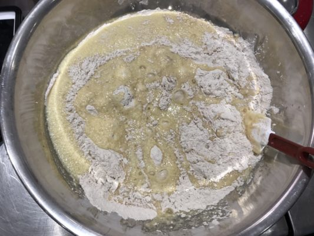

# Cider donuts don’t have cider in them and I won’t make them everyday

 

We[ first served donuts](https://www.cloverfoodlab.com/2009/11/20/apple-tasting/) way back in 2009 when we were just a single truck over near MIT. Friday I made them myself at LMA and HSQ. First time in a long time. And I had a blast.

Rolando, our chef at that time, called on a friend who ran the baking program at Johnson and Wales, and they were beautiful yeasted donuts, made from scratch and served warm from a truck. It was an unheard of thing back then.

I love donuts. So much. Everytime I see a donut shop I try it out. And I think donuts are great. And we should all enjoy them.

But not everyday. So we do them every month or so, as part of a special occasion or event. And we don't really publicize them. They're meant to be a fun surprise.

Our favorites are cider donuts. They are a version of a chemically leavened (cake) donut, similar to what people call "old fashioned." They don't have any apple cider in them. You will find recipes online that have cider added. This isn't traditional. Often it happens because a chef is asked to make a "Cider Donut" and assumes they have cider in them. They don't. Cider Donuts are to be eaten with cider, that's where the name comes from. So if you grew up in rural New England, as I did, you have indelible memories of the smell of cider donuts at Apple Orchards this time of year.

A bunch of folks have been asking me if we can make these more often. I just don't think we'd be doing the right thing for you all if we did that. Treats should be treats. And if I serve something so delicious everyday I'm afraid we'd all eat more of them than we should.

But if you really can't wait for the next event: here's our recipe if you want to make these at home:

 

**Cider donuts (butter needs to be room temp)**

yield 60 donuts

  * 3 cup granulated sugar
  * 1.5 sticks of salted butter, at room temperature
  * 6 large eggs, at room temperature
  * 10 cups all-purpose flour, sift after measuring, plus extra for work surface
  * 3 teaspoons table salt
  * 6 teaspoons baking powder, sifted
  * 3 teaspoon baking soda, sifted
  * 4 teaspoons ground cinnamon
  * 2 teaspoon freshly grated nutmeg
  * 2 cup low-fat buttermilk
  * 1/4 cup cider vinegar
  * 3 tablespoon vanilla extract

Cream the butter and sugar. This is the most critical step. If you're not sure exactly what it means to cream butter look it up online. It usually takes me 5-10 minutes in a stand mixer.

While butter is creaming, sift the flour and add remaining dry ingredients. Mix well with a whisk for at least 30 seconds, to disperse spices evenly.

Add the eggs to the butter and mix until completely incorporated.

Add the apple cider vinegar and buttermilk. Mix until combined.

Add the liquid to the flour mixture, fold until dough comes together, but don't over work. Roll on plenty of flour (this recipe fills a 1/2 sheet pan perfectly). Should be about 1/2 to 3/4 inch thick.

If you're not ready to make the donuts transfer sheet pan to the fridge until you are. Cover to keep from drying out. If you're hungry you can go straight to fryer.

Use a donut cutter (or biscuit cutter, or cup in a pinch). Drop donuts into fryer set at 350°F. Fry for 1.5 minutes, then using a fry skimmer push the donuts to flip them over. Cook for another 1-2 minutes. They will be a little dark in color, that's OK.

Remove from fryer. Let cool 20 seconds. Then toss in nutmeg sugar (1 cup sugar to 1 Tablespoon nutmeg).
