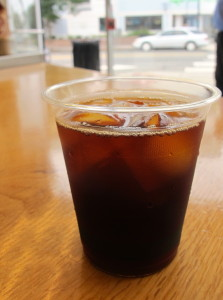

# Cold brew at Clover?

You might remember early on we served cold brew coffee. Then customers started coming up to the truck saying they hadn't slept at all after drinking our coffee at lunch. Ayr did some research on caffeine levels. And we moved to our single-cup iced coffee. But we still had folks asking us to give it another chance. And we realized that cold brew could occupy an interesting area on our menu.

Chris made up a batch using Barefoot Yirgacheffe. We're testing it today at CloverDWY (truck at South Station) and CloverBUR (restaurant in Burlington, Mass). Here's the basic recipe Chris used. We'll likely adjust it based on feedback today.

COLD BREW:

1\. Grind one 5-pound bag of coffee to a coarse ground (it should feel like coarse ground black pepper)  
2\. Add 22 quarts of cold water. Stir.  
3\. Allow cold brew to sit in the fridge for 48 hours.  
4\. Strain twice. Refrigerate

We're not trying to play Russian Roulette with anyone's sleep schedules, so we're doing $2 for a 7-oz cup. If you try it today, let us know what you think.
