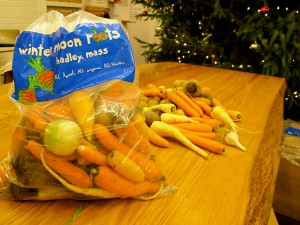

# Cook your CSA: Carrot Soup

These are probably the best-tasting root vegetables in New England right now, and I'm taking them all home.

Some of you know our aspirations to bring CSAs to fast food. The idea is pretty simple. Customers come to Clover, read about CSAs, sign up for one online, and return to Clover to pick up their share. We try to make it as painless as possible. Those of you who are getting a share today should let us know if we succeeded.

This is our first time doing a Winter CSA. We're really honored to be working with Michael Docter. He's been farming in Western Mass for the past 20 years. He bumped into the MIT truck 2 years ago, and said he wanted to grow for us one day. It took a year to get to a place where we could buy from him, and support CSA pickups too. We took sign-ups for the past 3 weeks and signed up 42 customers. And now everyone's coming into the restaurant to get their shares. It's really exciting for me to see it all come together. Rolando's going to share one recipe for each pickup. Read on for the recipe for spiced carrot soup. Disclaimer: we are scaling these down from recipes that feed 100 people, so if you make it at home, let us know how it turned out. 

CLOVER SPICED CARROT SOUP

(Serves 6)

Ingredients:

1 tablespoon vegetable oil  
1 large onion, medium chopped  
2 garlic cloves, peeled and sliced  
2 teaspoons Garam Masala   
1 medium potato, washed, medium chopped  
1.25 pounds carrots, washed, trimmed, medium chopped, plus 3 carrots for garnish  
1.5 quarts vegetable stock  
1 bay leaf  
2 oz Half&Half  
2 teaspoons brown sugar  
2 teaspoons Aleppo pepper (or another chili pepper)  
salt to taste  
fresh mint, finely chopped, for garnish

Instructions:

1\. Pre-heat soup pot over medium heat.  
2\. Add oil and onions and cook for 5 minutes.  
3\. Add garlic and caramelize onions, 5 minutes.  
4\. Add carrots and sauté for 5-10 minutes.  
5\. Add Garam Masala, cook 5 minutes, stirring occasionally.  
6\. Add potato, vegetable stock, and bay leaves and bring to a boil. Turn down to a simmer and stir occasionally.  
7\. When carrots are tender, add brown sugar, Aleppo, and Half&Half. Simmer for an additional 15 minutes.  
8\. Remove bay leaves and blend in batches until super smooth.  
9\. Adjust to a medium viscosity, then taste and adjust seasoning.  
10\. Garnish with a mixture of carrot crisps and finely chopped fresh mint.

For fried carrot garnish:

Wash and peel 3 carrots into strips. Fry at 300°F til they are crispy and stop bubbling. Drain and toss with salt.
