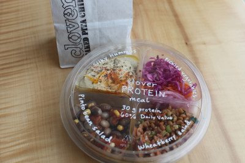

# Eat the future… Clover meals

I have a feeling these could be huge. Who knows, maybe they'll eclipse everything we've done to date. But in a way that would be fine. We've been working so hard over the past few years to build a company, not a sandwich.

This is one of the fun and surprising discoveries we made last week at Brookline when testing our Clover Meal Bar for WFM. A customer asked: "Am I going to fill this, or will you have these already filled." We honestly hadn't considered making these up ourselves at that point. And it may seem obvious after seeing this picture. But so many discoveries are like that. They feel obvious after you've seen them, even if opaque prior.

So we thought we'd give this suggestion a try. And they're beautiful. And filling. And delicious. We have a few: Clover Winter Meal, Clover Mediterranean Meal, Clover Spicy Meal, Clover Southern Meal, Clover Protein Meal (the one you see here). They're all a combination of hearty vegetable salads, pickles, and bean dips of some sort. Think hummus, white bean dip, etc. They're nutritionally balanced. This one packs a hefty 60% of the protein Daily Recommended Value (for a 2,000 calorie diet). We're hawking baked pita chips on the side for those who want them.

I brought some home. My kids were nuts for them. I shared them with my parents in law, they loved them. And I don't think they were just saying that. Customers have been coming back for them, and telling friends. It's been really fun and delicious. They're super packable, sharable, delicious the day after (even though we've only been selling them same day). They're packed with seasonally appropriate local produce, beans, etc. It's just awesome.

We're going to be piloting these at Kendall Square next week. Get ready folks. These are going to be really fun.
