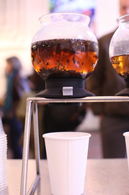

# “It’s expensive and breaks”

We were touring Blue Bottle's roasting facilities in NYC the other day (I'll post more on that shortly), and I noticed these interesting orbs at the back of the space. I asked about them and was told that they were a new tea brewing apparatus that Blue Bottle was testing. You might know I love tea. So I was obviously interested. I asked how they work and the staff sort of moaned. They said that basically they are "very expensive and break."

Of course I hadn't left NYC before ordering a set on Amazon. They weren't as expensive as I feared, and I ordered 3 to try out. We tested our current recipes and alternates. Turned out existing recipes were really tight. I made up a little nifty sheet telling staff how to use them and care for them. And I added something we don't usually do when testing, a list to use to mark off how many uses they've seen. I want to know brew to break ratio to see if these are feasible.

They're at work right now at our Harvard Square location. Check them out and tell us what you think. They fit right in line with the coffee rack, which is awesome. And really, I've never found anything that's done such a killer job making tea sexy. You know poor tea, for one it's not addictive like coffee. Two, it doesn't come out of a steaming loud espresso machine, or from a careful pour-over set-up. Even the humble insulated coffee dispenser has mystery. Tea is normally a bag floating in water. So I welcome anything that will elevate our impression of tea. And the teas we're buying and brewing are out of this world. They're some of the best you can buy anywhere in the US. I'm hoping more customers get to try them if we use this apparatus. Tell us what you think.

(Yes, and I realize I very well may have jinxed our perfect record of no breaks by posting about how great these are. Let's hope not.)
