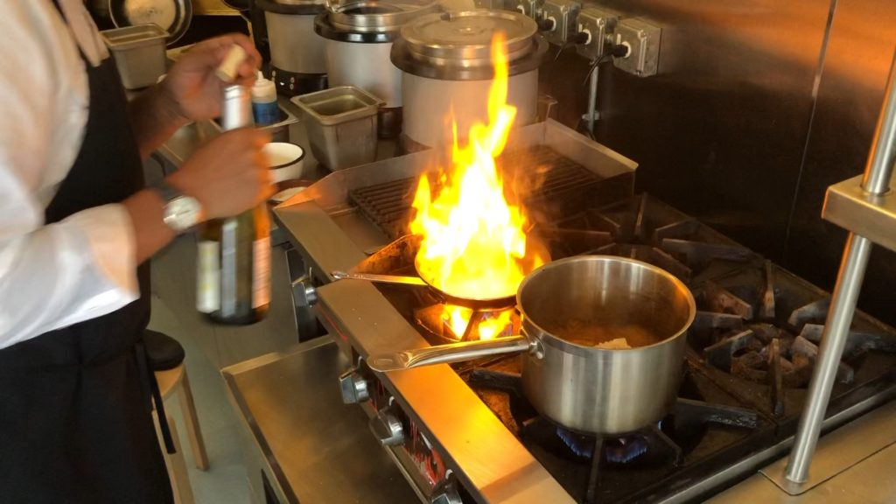

# Fire and caramel, staff meals and squash deliveries, giant soup pots and mini spatulas

This winter we found ourselves leaving the Clover kitchens and heading into the kitchens of some of our favorite chefs in town this spring. We were filming for an Instagram Series called Chefs Love Soup.

We visited Jason Bond of [Bondir](http://www.bondircambridge.com), JuanMa Calderon of [Celeste](https://celesteunionsquare.com), Joanne Chang of [Flour](https://flourbakery.com), Rachael Collins of [Juliet](https://www.julietsomerville.com). Did you know you can make soup using caramel?! Or that in Peru, they eat soup for breakfast, lunch, and dinner!? It was magical to go into our favorite restaurants during the quiet yet focused hours of the day, after deliveries come in, but before customers arrive. And the soups we tasted were just delicious. When you're not chowing down on soup at Clover, go support these folks, they're doing awesome stuff.

[CHEFS LOVE SOUP TRAILER](../assets/2019/03/Soup-Trailer-.m4v)

[CHEFS LOVE SOUP SERIES](https://www.instagram.com/cloverfoodlab/)

[CHEFS LOVE SOUP: THE "COOKBOOK"](../assets/2019/03/Chefs-Love-Soup-3.pdf)

Trigger warning: We asked chefs to pick their favorite soup and make it for us. Not all the soups in the series are vegetarian. Some people on Instagram were very upset by this! We ended up having some really productive conversations about it (thanks all who engaged in a kind manner! Sorry anyone who felt upset!) Then again, we've never shied away from a little [brisket](https://www.cloverfoodlab.com/2011/03/16/ask-rolando-about-moist-brisket/) on the Clover feed from time to time…
