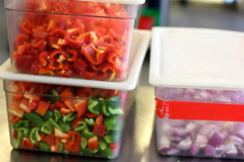

# Got a lot of peppers to use up this week? Make Enzo’s pepper relish spread

Vincenzo has all these family recipes from Calabria. Whenever he cooks for us I'm always reminded of the farmers markets I visited in Southern Italy. Peppers, tomatoes, onions, garlic. We only get to enjoy Enzo's pepper relish this time of year when we run the Pepper Relish sandwich in the seasonal slot. Customers have been trying the sandwich and asking us to bottle the relish and sell it by the jar.

Here's the recipe in the meantime. You'll want to scale it down for home use, unless you're planning to give away many jars.

Pepper Relish  
Makes 6 quarts

24 red bell peppers, cut in half lengthwise, seeds removed  
12 green bell peppers, cut in half lengthwise, seeds removed  
6 tablespoons yellow mustard seed  
3 tablespoons coriander seed  
12 red onions, peeled, large-diced  
1 bunch thyme, finely chopped  
8 cloves of garlic, finely minced  
4 dried bay leaves  
4 tablespoons extra virgin olive oil  
2 tablespoons salt  
4 cups sugar  
4 cups red wine vinegar  
1/4 cup hot sauce (use any hot sauce you like, [here's our recipe](http://www.cloverfoodlab.com/hot-sauce/))  
salt and pepper, to taste

1\. Preheat the oven to 350 degrees.  
2\. Line a baking sheet with foil. Toast the mustard and coriander seeds for 5-7 minutes or until aromatic but not burned. Alternatively, toast in a dry pan.  
3\. Heat a large pan over medium low heat. Add 4 tablespoons of olive oil to the pan. Add the garlic and onions and sweat them until the onions are translucent and sweet, about 15 minutes.  
4\. Add peppers, herbs and toasted spices. Cook over medium low heat for an additional 20 minutes.  
5\. Add salt, sugar and vinegar and stir.  
6\. Cook the relish for 45-60 minutes until the peppers are soft and the mixture has thickened.  
7\. Take off the heat and allow relish to cool for 15 minutes.  
8\. Take the cooled relish and transfer it to a food processor or blender. Blend on low speed until smooth but still a little bit chunky.  
9\. Add salt and pepper to taste. Refrigerate.

_Copyright Clover Fast Food, 2013_
