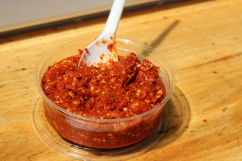

# Hot sauce

Ayr came across this Yemenese hot sauce called zhuk and had an idea to do a chunky hot sauce that changes throughout the year. Most of the year we use dried peppers. When fresh peppers come into season (now!) we use those.

Starting tomorrow we'll be selling to-go portions of Clover hot sauce every day at all locations. $1 for a 2oz cup. This has been something we've been really excited to do for a long time, and we've just now gotten it in place. We're going to have a bottle of Sriracha out for anyone who doesn't want to spring for the homemade stuff.

And if you want to make it at home (and can't wait for our hot sauce class in September!), try the recipe for yourself. It's a pretty forgiving recipe. Play around with it. Add other kinds of peppers. Adjust the spices. Tell us what you come up with.

CLOVER HOT SAUCE

Makes 12oz

2 quarts dried destemmed chiles de arbol  
6 fresh habanero chiles, stems removed and roughly chopped  
1.5 teaspoons whole coriander seed  
1 teaspoon salt  
1 teaspoon sugar  
1/3 cup white wine vinegar  
1/4 cup water  
2 garlic cloves

1\. Toast coriander in a dry pan until just aromatic. Or toast in the oven for 7 minutes at 350 degrees. Reserve.

2\. Put all other ingredients in a food processor or blender. Blend on high for 6 minutes or until the mixture is a chunky paste. Add coriander seed and mix to combine.

Copyright 2013, Clover Fast Food
