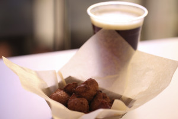

# Hush puppies

To be honest, I'm not the best person to write this post. I'm a New Englander through-and-through and we don't know what hush puppies are.

But I hear they're delicious. And I hear people love them.

Ours are probably not very traditional, not much we do is. But I've never had anything like them in Boston. They're corn-based. A bit of scallion and black pepper. They're sort of fluffy, but just enough to be light, they still have a satisfying crunch. After I took this picture Lucia and I battled it out, they were gone before they cooled from the fryer.

Rolando started working on these just after our trip to North Carolina when we visited Counter Culture's roasting facility.

Some of you have been asking about non-fried 3PM specials. Don't worry, the snow is about to melt. In the meantime enjoy the winter comfort.
