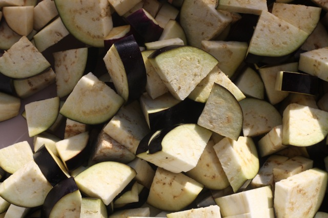

# I used to hate eggplant

The eggplant and egg sandwich has become a favorite for many customers. And I've heard more than one customer tell me they always thought they liked eggplant.

Well here's a small confession, eggplant was one of the foods I just wouldn't eat as a kid. The texture and the taste really put me off. I've come around though. Part of that was maturing taste buds and palette. But a huge part of it was learning more about how to prepare eggplant so that it tastes great.

Like most of the food you eat from us, this sandwich is the culmination of hours of careful preparation. It starts with very fresh eggplant. We get a delivery of the best eggplant every day or two. No soft spots, no discoloration, taut thin bright purple skin. The eggplant is cut into the shapes you see above every morning.

Then comes the salt. We lightly salt the eggplant and let it stand for 3-4 hours. The salt draws out the bitter liquid in the eggplant. We then press/ drain the bitter liquid, rinse the salt from the eggplant, and then fry it. No batter or anything like that, just a light frying.

Some of you may know this sandwich is inspired from a popular middle eastern sandwich called "Sabich." As with all of our food, this is our interpretation of the original, no claims to authenticity.
