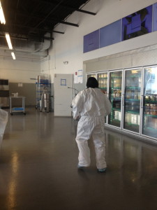

# John dons a tyvek suit to collect samples

John's our Director of Finance and Control. The suits he wears aren't normally white.

He's been doing an awesome job over the past few days helping the inspectors and public health officials from the state move the investigation forward. Right now we're waiting for lots and lots of samples to come back. We've gone through potential vectors for the Salmonella, assuming it found its way through Clover food. Salmonella is either spread by (a) a tainted product that is not cooked or (b) an employee who is carrying Salmonella and not following proper sanitation procedures. I've said before, while I completely support a thorough investigation that includes every possible source, it's nearly impossible for me to imagine one of our employees was the vector for this outbreak.

Based on the items eaten by the 6 customers at Clover (we don't know what they ate at other restaurants) we know that customers that may have been potentially exposed ate either the Chickpea Fritter Sandwich (and one ate the plate) or the Egg and Eggplant sandwich. (We don't have any information about the other 6 of 12, and as of today I don't have information about any new confirmed cases associated with this outbreak). The only ingredients common to those two sandwiches are:

(a) Tahini sauce (a tahini paste we buy from a local supplier who's operation we've toured and been very impressed by, lemon juice that has been pasteurized, Kosher salt, and 2-stage filtered city of Cambridge water)

(b) Cucumber and tomato salad (cucumbers washed in our special PowerSoak mechanical vegetable washer, tomatoes washed the same way, lemon juice that has been pasteurized, Kosher salt)

(c) Hummus (organic dry chickpeas we soak and boil ourselves, tahini paste from a local supplier same as tahini sauce, baking soda, 2-stage filtered city of Cambridge water, fresh peeled garlic that we peel ourselves, kosher salt, ground cumin from a local supplier)

(d) Bread - our only ready-to-eat item that we don't make ourselves (meaning we don't cook it, we warm it, but that's not the same from a germ standpoint)

Based on this analysis the state inspectors have worked with us to isolate samples of items that could have been a part of this to send out to a lab for testing. This happened the other day and we're waiting for results. Additionally, we (the inspectors) collected samples from the environment to make sure there wasn't any Salmonella present there. Finally, in addition to the food and environmental sampling, we've been having all of our employees who could have possibly come in contact with the items above tested. We'll make sure all employees are cleared before anybody returns to work.

It's sort of excruciating now. [read on for more details]

Most of the sampling has been done. We now wait, for what seems like a very painful period of time. We're keeping busy by doing additional cleaning of all locations, including trucks, ensuring they are perfect. And we're trying to make jokes, to keep spirits up. Some of those may involve Megan (you can ask her why). Lucia is trying to figure out what to do for CSAs. Chris is working to get repairs and maintenance done, with everything shut down it's a great opportunity to do that stuff. And I'm trying to plan for the future. And talking to lots and lots of reporters telling them I don't know as much as I'd like to know.

I have had several calls from reporters asking about various public records, including older inspections. I thought I'd share some of those conversations here so you can all be privy. The truth with all of this stuff is I don't have nearly as much information as I'd like. It's frustrating.

- Question: How long since the last case you know of? A: almost 3 weeks

- Question: When will you be able to open? A: We don't know.

- Question: What do you have to do to confirm your facilities are clear to operate? A: We don't know yet. We are waiting for a meeting with the State that will not happen until Friday.

- Question: Can you tell me if you suspect any specific suppliers. A: I'd rather not talk about that without more evidence.

- Question: There was a health report in 2011 (this is by memory, I may be wrong on the date) at HSQ that mentioned a customer reporting illness. How does that square with your claim that no illness has been associated with your food ever? A: When any person suspects food poisoning Cambridge does a thorough interview of every place they had eaten, then they visit each establishment. If they have no reason to further investigate a given establishment, and there are no further reports of illness, they clear that establishment. In this case a customer had eaten at Clover in the days prior to being sick. If I remember correctly, and I was the one who met with the inspector because I was personally concerned about it, they ate at a couple other places. The inspector at the time told me she was sure it wasn't Clover, and we didn't worry further.

Question: There was a report about the PRK truck not having handwashing water. What's up with that? A: This was a while back, but I think I remember what happened. Again, I was really concerned and we did a bunch about the incident to correct and make sure it wouldn't happen again. Out handwash sinks are supplied by tanks of water on the trucks. In this case the tank was empty when the inspector stopped by. These tanks should be refilled when they run out. And while the manager of that truck told me that it was just a case of not having filled it when one person used up the water, and while I trust my managers, neither I nor the inspector could be sure that was the case. No water is no water. Even if, like leaving an empty roll of toilet paper in the bathroom, it was a simple error. We can't make those sorts of errors.

Following this incident we did a bunch of things. (a) We fixed the problem on that truck. (b) We hired a Food Safety Consultant to help us create procedures that would help prevent such thing from happening again, (c) we started doing internal unannounced sanitation inspections at all locations monthly, (d) we have a policy that if a location fails their internal inspection and does not fix in a defined amount of time we will close their location, (e) we hired that consultant to do an independent 3rd part inspection unannounced quarterly, (f) with new truck designs we ensured the hand wash sink would be the last thing to run out of water on the truck. This was an important growing stage for us and helped us pioneer some practices of which we're really proud.

- Question: Did Cambridge shut you down? Or the state? Or was it voluntary? A: Friday afternoon I had a couple phone calls with state officials. They asked "would you consider closing voluntarily?" I said "Absolutely. But before I make that decision I'd like you to share written information with me about these incidents." I didn't know basics (how many people, what they ate, where, etc.) and I had nothing in writing, and I felt it wasn't responsible to take action until I had at least basic information, something more than a phone call of concern. They told me they would want to have a local Cambridge inspector perform an inspection to help with the investigation. I said, of course, we'd like that. And anything else we can do to get to the bottom of this. I expected an inspector Monday morning. This was when I was still thinking this might be the breakfast sandwich, and I'd pulled that from the menu immediately company-wide. I later learned the breakfast sandwich appears not to have been implicated at all in this outbreak. A Cambridge inspector showed up at the HUB late Friday, right before the end of service, and told us she wanted to do an inspection, and that we'd have to close the restaurant, etc. during the inspection. She told us this was to help with the salmonella case. We went through our facility with her in detail. She wrote a report and told us that we shouldn't move any food in or out of the facility until the investigation was complete because the state didn't know if it was contaminated and that we'd likely want to sample. She asked us not to move trucks, etc. and not to serve.

Friday night, after we'd had conversations with the Cambridge inspector we had enough concern to shut down all locations, specifically including all of the locations that we had not yet been asked to close. I still didn't have further facts from investigators at that time (and still have very little), but given the seriousness of the way they were handling this I felt there was enough to make me concerned. I still didn't know much Friday night, but I decided we should shut everything down. Saturday we were in crisis mode. We were testing all employees we thought could be exposed, gathering up receipts from past purchases of food, investigating suppliers, interviewing employees and managers to account for 100% health history company wide. Later that day I pulled my head up, took a deep breath, and decided to go ahead and post about what was happening as openly and honestly as I could.

Sorry, this is a massively long and detailed post. I think there are a lot of details here that wouldn't and shouldn't interest most of you. But I wanted to make sure you all had access to this and a chance to read the detail if you're curious. I'll do my best to share more info as we have it, and to answer questions that come our way.

We're planning an opening party everybody. We're hoping this comes to an end soon.
