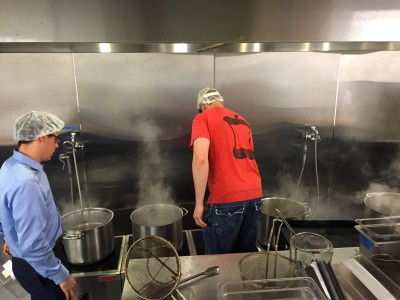

# This is what Kashering looks like

I'm not Jewish. I was raised going to a small New England brick congregationalist church a couple of towns over from where I grew up. But I've wanted Clover to be Kosher for a long time. I had a colleague at McKinsey who kept fairly strict Kosher, and I was shocked what a nightmare it was for her to try to find food she could eat. I have no idea how many people in Boston keep Kosher, but I want Clover to be accessible to everybody and I started thinking about getting Kosher certification a long time ago.

When we built the HUB we bought special vegetable washing equipment that I thought could help with this. Now, many years later, we're going through our first Kashering. One of our customers, a student at MIT, talked to me a couple of months ago and introduced me to Rabbi Dolinger and we started talking in more detail about what it would take. I couldn't be happier that we're making this work.

That's Rabbi Dolinger on the left, Chris on the right. They are boiling many full pots of water. The ovens are all running full blast, and we've limited dinner service at the HUB. Sorry everybody, but it's for a great reason!

To be honest I'm not entirely sure how fast the process works, but I'll let you know when we're official. We're going to Kasher all Clover operations including all trucks and all restaurants and our commissary. That means our upcoming items sold at Whole Foods will be Kosher. This is really exciting for us all.
