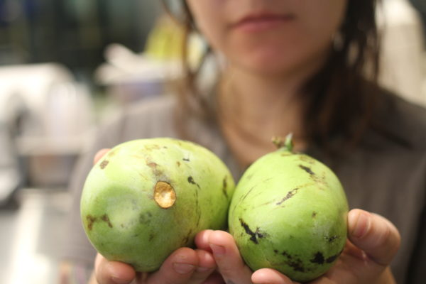

# Paw paw landed

I didn't really know what Paw Paw were 10 years ago. Then I heard about them and they sounded magical. And it took me 4 years of searching to find somebody in Massachusetts growing them.

This is a tropical fruit that belongs to North America. It smells like a tropical fruit. It tastes like a tropical fruit. When you open one the interior is like a perfectly set custard. And the taste is totally unique. Sort of like a banana, a bit like mango, even ripe papaya. It's very unique.

The crop this year is limited. We're serving it as a soda syrup. It's a great use. The flavor is really clear. And it's accessible. Find Paw Paw at Clover while it lasts (likely 1-2 weeks).
