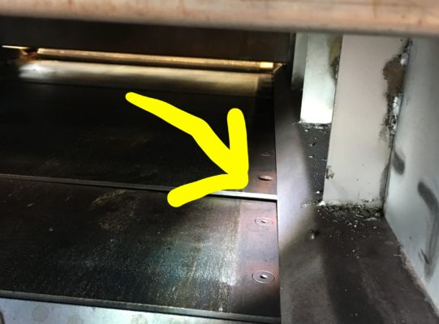

# Pita oven down…

Our [very special pita](https://www.cloverfoodlab.com/2013/06/24/clover-baking-pita/) oven is down. If you don't know, we spent 2 years getting this oven from Lebanon licensed in MA, and now we make the best pita anywhere using New England-grown wheat.

We're working on getting it up by tomorrow (Tuesday). In the meantime our Sunday was baked in small batches in conventional ovens. And the bread today (Monday) and tomorrow (Tuesday) will be from a supplier we used to work with (pre-special pita oven days) that is in New Jersey.

This picture shows the culprit. A screw got loose. It jammed up the conveyor belt that brings the bread through the 900°F oven. And one of the gears on the motor that moves the conveyor belt lost a tooth.

This means Chris (our VP of Food) and his team have been working long hours in the commissary over the weekend getting this sorted out (and making sure we have bread in the meantime).

We should have had a replacement motor on hand. This is a good learning for us. But happily our back-up bread supply is letting us operate as normal. Thanks to everybody helping with this!
