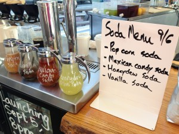

# Popcorn soda

 

Michael Sutton (Clover BUR general manager, formerly of O Ya) had an idea for popcorn soda. Pretty crazy, right? I asked him what that would be. He thought we'd just blend popcorn into the soda syrup. I thought it was a crazy idea, but it stuck with me. The other evening at the beer launch at Harvard Square Chris was making brown butter popcorn and I borrowed some to try out that pop corn soda idea. It's amazing. Really awesome. Think jelly belly popcorn flavor. It's a new member of our growing soda menu. Something Michael suggested we do because everybody in the suburbs was asking for soda.

Here's the recipe I used:

3 Cups sugar (you can scale down if you want)

6 Cups boiling water (to dissolve the sugar)

1 Tablespoon lemon juice (we've found almost all sodas benefit from some acid)

1/2 Teaspoon salt (brings out the flavor)

Now that's our base soda syrup recipe. Typically I'll gather those ingredients, put them in a blender (carefully) and blend for 1-2 minutes on high (carefully, in batches if necessary), then strain (I use a [chinois or china cap like this](http://www.foodservicewarehouse.com/royal-industries/roy-ccf-8/p6766.aspx?utm_medium=cpc&utm_term=Royal-Industries-ROY-CCF-8&utm_campaign=China-Caps&utm_source=googleproductfeed&source=googleps&gclid=CIfB4vOYx7kCFXAaOgodmgYALA)). For fruit or berry soda we'll add:

1 Cup of melon OR

1 Cup of blueberries OR

1 Cup of peaches OR

1 Cup of any fruit or berry. yum.

For vanilla soda just add 1 whole pod of fresh vanilla, no need to scrape. Just add it whole.

And now, for pop corn soda just add:

3 Cups of popcorn, already popped

Crazy, but that's it. Blend away, strain. If you want to go nuts add some browned butter and extra salt.

The real genius of these syrup recipes is that (A) they are ridiculously easy to make, and (B) they are a relatively "light" syrup, meaning less sugar to water. This allows more flavor to pack into the syrup and better mixing with the soda. They're not an optimal syrup for mixed drinks, but absolutely perfect for sodas. Have fun!!! You can try at different portions. We fill a 14 oz cup with ice, then soda water, leaving room for 4 ounces of soda syrup.
