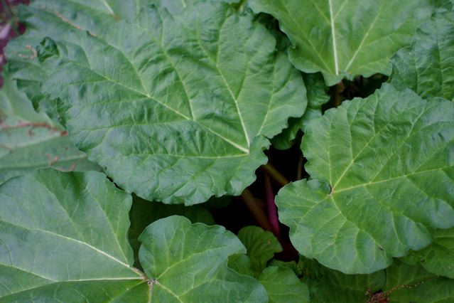

# Rhubarb

Rhubarb cooler, rhubarb muffins, rhubarb and yogurt with granola. What's up with Rhubarb?

I LOVE Rhubarb is what's up. And it's local, and it's in season. But most of all I've loved it since I was a little kid. For those of you who aren't familiar, Rhubarb is tart (think lemon or lime), but mellow, without the citrus bite. It's a bit hard to describe. Sour without the pucker. And there's a little bitterness in there, but even that isn't harsh at all. And there is a special unique rhubarb taste that's unlike anything else. It's this taste that makes me so excited about this time of year.

Rhubarb recipe and more history after the break.

When I was a kid the family running the town general store, the Streeter's, had a huge ancient rhubarb bush in their yard across the street. It always made more than they could eat, so they would share with folks like us. My dad would come back from the store this time of year with arm-fulls of rhubarb.

Rhubarb is a vegetable, but works more like a fruit. That's mostly because it loves sugar, and people always make jams, and pies, and tarts etc. We're going to try to work a savory rhubarb recipe into our menu before it's out of season. I'm thinking perhaps a Rhubarb pilaf. Keep an eye out early next week

My favorite preparation of Rhubarb is super simple. You trim the stalk, and cut it into 1/2″ pieces. My grandmother used to remove all of the strings, but I always thought that was sort of a pain and crazy. Then you toss in sugar, enough to gently coat the rhubarb pieces. It'll stick because the rhubarb is a bit wet. You can taste one like this. Yum. Get a pan on the stove, heat it up, add the rhubarb, and a very thin layer of water. Let the water boil around the rhubarb for about 5-10 minutes. You'll be left with a slightly watery rhubarb sauce. It'll firm up a bit as it cools, but not too much, and that's OK. Awesome on pancakes. Or, as we're serving it up at the truck, on yogurt and granola.

And if you want a rhubarb cocktail you'll have to come to my house, we haven't been able to convince Cambridge street liquor service is a good idea : )

This is a long post, but Rhubarb deserves it.
