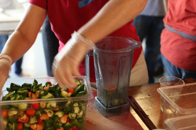

# September is hot pepper season in Massachusetts

September means fresh peppers in Massachusetts, which means our Hot Sauce 101 class is back. You'll learn how to make Clover's hot sauce featuring local hot peppers, coriander, garlic, and vinegar - and if there's time - some other versions of hot sauce too. You'll leave with a jar of fresh hot sauce to take home.

This class came about three years ago when Danna and Chris, two customers at the MIT truck, who were addicted to our hot sauce, begged us to teach them how to make it. Enzo's teaching, which means it will be a good time.

Wednesday, September 17, 4pm-5pm

Clover Kendall Square, 5 Cambridge Center, Cambridge, MA  
$35 for general public. Free if you're a CSA member who picks up your share at Clover.  
Click the lefthand tab of the website to sign up.
