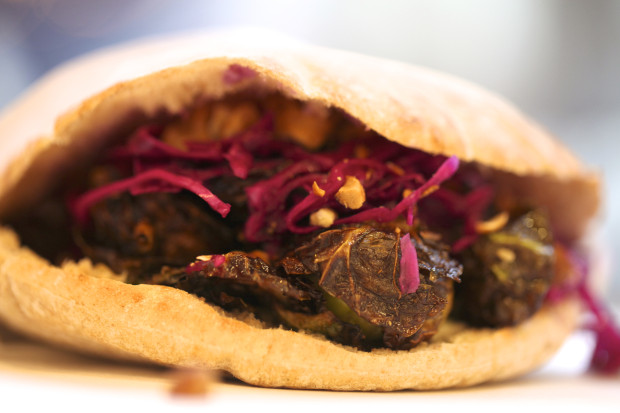

# Sour cream dijon spread for brussels sprouts

Ayr wanted to create a sandwich that would redeem brussels sprouts for everyone who'd had them boiled or steamed or otherwise destroyed.

I think it's safe to say I am the Brussels' biggest fan. I will admit that I've brought Brussel Sprout sandwiches to places where they may have been unwelcome. On trains and buses to New York City (sorry that person I was sitting next to on the Megabus!). To the movies (Sorry to those of you at the 7pm screening of Llewyn Davis at Kendall Cinema last Wednesday!). If you see me, there's a good chance there is a Brussels sprout sandwich, wrapped to-go, in my bag.

One of the best parts of the sandwich is the spread. Garlic, sour cream, Dijon mustard, a little mayo. I think it would make a nice dipping sauce for brussels at home. Here's the recipe if you want to try.

Sour cream dijon spread

1/4 cup mayonnaise  
1 lb sour cream  
3 cloves garlic  
1/4 cup Dijon mustard  
salt, to taste

1\. Peel garlic  
2\. Add garlic, mayonnaise, and dijon into a blender and blend until silky smooth. NO GARLIC LUMPS.  
3\. Add sour cream and pureed mustard mixture to food processor. Mix on low for 10 seconds.  
4\. Taste. Add salt to taste.

Copyright 2014, Clover Food Lab
