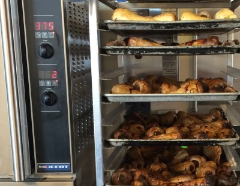

# Spring Dug 2014

We've been waiting and waiting and waiting. I first learned about Spring Dug Parsnips the second year of Clover, back in 2009. They're a little known item, farmed by only a few. Most Parsnips are harvested in the fall, and they're parsnip-y. Like big white carrots that taste a bit like Rutabaga. Unlike their root vegetable cousins Parsnips can winter. And some farmers still do this. You leave the parsnips in the ground and pick them in the spring when the ground thaws. We've hooked up with Michael Docter, our favorite organic root farmer in Western Mass and we're buying these by the pallet.

That's right, the Spring Dug Parsnip is the first harvest of the season in New England. That thawing normally happens in March, but this year we're a bit late. The best thing about Spring Dugs is that they're super sweet and deep in flavor. Roasted they're one of my favorite foods, hands down. Texture is awesome. They're sweet, but savory. The flavor is complex and deep. This is what vegetables can be if we pay attention to them.

We just launched our Spring Dug Parsnip and Cheddar sandwich company-wide. This picture is from this past Wednesday, the second day of the sandwich. We're pairing the parsnip with spring onions (which admittedly aren't from New England quite yet, but will be soon), first pick spinach (which I think is from New England greenhouses, need to check with Chris on that), and sharp Cheddar cheese from our friends at Grafton in VT.
