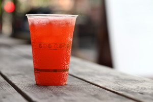

# Make Clover strawberry soda for your Fourth of July cookout

Happy Fourth of July! Clover MIT will be serving from 11am until the first Fireworks start. CloverPRK at the Common will be open til 7pm. And all 4 restaurants will be open usual hours (though you should check Twitter before heading out).

If you're looking for something fun to take to a cookout tomorrow, try this strawberry soda syrup. Enzo made this at our first CSA Cooking School class last week and everyone was begging for the recipe. You can add it to carbonated water over ice. But I think it would be awesome with a little vanilla ice cream as a strawberry float.

STRAWBERRY SODA  
Makes 40 servings

1 quart strawberries, whole, stems not removed  
1 3/4 cups sugar  
1.5 oz lemon juice

1\. Place strawberries in a large bowl. Cover the strawberries with the sugar. Let sit for 5 minutes.

2\. In a blender, blend strawberries and sugar for 1 minute or until completely incorporated.

3\. Stir lemon juice into strawberry puree. Let sit for 10 minutes. This will allow the sugar to finish dissolving into the puree.

4\. Pass the strawberry puree through a double-mesh strainer, pressing with a rubber spatula to capture as much of the puree as possible. Refrigerate syrup until ready to use.

5\. Make a test batch. Fill a plastic cup halfway with ice. Fill a 1.5-oz soda jigger with strawberry syrup and pour over ice. Top off with carbonated water. Adjust amount of syrup to taste, and repeat for future cups.

Copyright 2013, Clover Fast Food
