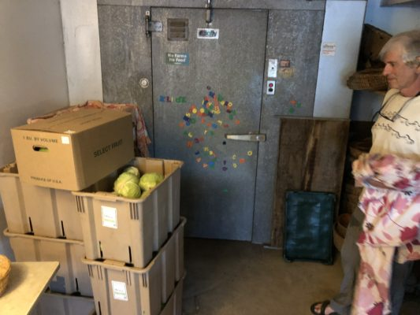

# Thanks for eating the green cabbage!!

Chickpea Fritter aficionados have noticed. The purple in the sandwich has been green these past few weeks. We normally use pickled red cabbage. I'm not even sure why honestly. It's one of those things we've done since the beginning. I'd guess I liked the color it added.

The other week Ari and Moira who run Lindentree Farm wrote to Chris letting him know they had a really great crop of green cabbage, more than they could distribute through their farm share.

Chris ran the substitution idea by me, it tastes great, better I think than what we had before, probably because Ari and Moira have such beautiful organic cabbage. We've purchased over 1,000 lbs in the past week.

We don't often mess with the Chickpea Fritter but it was fun to play with this change. Let us know what you think of the green cabbage!
