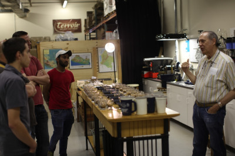

# I think our coffee can be better

The other week we joined George Howell to taste new coffees. Tasting with George Howell is amazing and the coffees were surprising and beautiful. Chris who runs our food set this up, two of his managers had a chance to join, as well as Sean who is going to run our DC region.

We just brought one of George Howell's coffees in last week: [Karatu AB](http://store.georgehowellcoffee.com/coffees/karatu_ab_lot086_kenya.html). Everybody has been loving it and you can try it this week at any of our restaurants or trucks. It tastes sort of like jam to me, berry notes but dark. Maybe a bit like plum jam. Tell us what you think.

I had to run off to a flight to DC right after this tasting, but I asked George if he'd help us re-work our coffee program. We've put a massive amount of research into our current coffee program. When we started coffee at Clover 5 years ago I met George at this same spot in Acton and asked really stupid questions. I didn't even know who he was or how important a role he has played in the industry, or that he was the inventor of the Frappucino. Since then we've visited nearly 20 roasters across the country and asked many more questions. We rotate in those that we love. We've tasted every coffeeshop we can find in every major city. And second to Blue Bottle, I don't think there is anybody in the country with more experience serving pour over coffee. We're talking more than a million cups of pour over coffee.

Each day we hear somebody tell us they just had the best cup of their life. I love hearing this, but I think we can do better.

In particular I'm not happy with the variability of our iced coffee. I haven't wanted to do cold brew because I'm afraid of lethal doses of caffeine. OK, maybe not lethal, but make-your-hands-shake extreme. So maybe there is a way we can do cold brew with less caffeine. At home I've started making hot coffee with less grounds. When we started our portioning was 1/2 what we saw Blue Bottle doing (they were pouring 48grams for a 12 ounce cup, I have it on video, crazy!). But at this point I think we're actually a bit heavy in the dosing department, using 25 grams where others would use 15 grams.

Of course, these sorts of adjustments need to be thoughtful and deliberate, and tested over and over with customers. Don't expect this change to happen overnight. But if you're at one of our restaurants in the coming months don't be surprised if we offer you a sample and ask for some feedback. You may even see George around helping us figure out what the future of pour over should look like. We'll all be in good hands.
