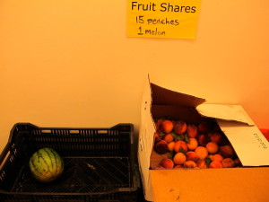

# Make salty watermelon agua fresca and peach agua fresca this weekend

I've been in a great mood all day. It's a beautiful, dark, rainy Friday. Which makes me happy. But I'm told it's going to be "nice" this weekend. Which is going to make everyone else happy : )

Peaches and watermelons are in. What will you make? Here are two places to start, both inspired by Latin American agua frescas…

PEACH AGUA FRESCA

Ingredients:  
7 ripe peaches, washed, pits removed, cut in quarters  
7.5 quarts water, plus 1 cup water (for simple syrup)  
1 oz lemon juice  
1 cup sugar

Special Equipment:  
Blender  
8-qt plastic or glass container (we like [Cambro](http://www.foodservicewarehouse.com/cambro/8sfspp190/p9925.aspx?utm_medium=cpc&utm_term=Cambro-8SFSPP190&utm_campaign=Graduated-Containers&utm_source=googleproductfeed&source=googleps&gclid=CNHN6Yis8bgCFZSY4AodCQoAEQ), you can buy them at Eastern Bakers Co.)

1\. Place peaches and water in a blender. Turn speed to high, and blend until very smooth, at least one minute.  
2\. Strain through a double-mesh strainer into a plastic or glass container.  
3\. Add lemon juice.  
4\. Fill to 7.5-quart mark with water.  
5\. Make simple syrup. Bring 1 cup water to the boil. Pour over 1 cup sugar and whisk until sugar is completely dissolved.  
6\. Taste agua fresca and adjust with water and simple syrup. You're looking for a lightly sweet peach flavor.

Copyright 2013, Clover Fast Food

Read on for the recipe for Watermelon Agua Fresca (secret ingredient: salt) after the break….

WATERMELON AGUA FRESCA

Special Equipment:  
Blender  
8-qt plastic or glass container (we like [Cambro](http://www.foodservicewarehouse.com/cambro/8sfspp190/p9925.aspx?utm_medium=cpc&utm_term=Cambro-8SFSPP190&utm_campaign=Graduated-Containers&utm_source=googleproductfeed&source=googleps&gclid=CNHN6Yis8bgCFZSY4AodCQoAEQ), you can buy them at Eastern Bakers Co.)

8 cups of 2-inch watermelon chunks (seeds removed, etc)  
7.5 quarts water, plus 1 cup water (for simple syrup)  
1 oz lemon juice  
1 cup sugar  
1 teaspoon salt

1\. Place watermelon chunks in blender with 2 cups of water. Turn speed to high, and blend until very smooth, at least one minute.  
2\. Strain through a double-mesh strainer into 8qt Cambro.  
3\. Add lemon juice and salt. The salt is key for this agua fresca!  
4\. Fill to 7.5 quart-mark with filtered water.  
5\. Make simple syrup. Bring 1 cup water to the boil. Pour over 1 cup sugar and whisk until sugar is completely dissolved.  
6\. Taste agua fresca and adjust with water, simple syrup, and additional salt and lemon juice.

Copyright 2013, Clover Fast Food
