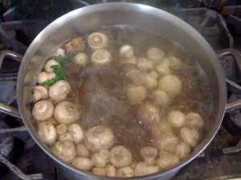

# Soup stock recipe development

Our original stock recipe was a very light vegetable broth. The stock was light, almost like water, a backdrop for the main show of the soup or other dish.

We kept noticing that our soups weren't coming out as full-flavored as we'd like. We decided to revisit the stock, and work to create something more rich and flavorful. A stock you could sip on its own as broth. A stock you might even want to buy and take home and cook with.

In order to achieve this we wanted the stock to have an umami element to it. We did this by adding some new ingredients, and increasing the amount of existing ingredients. We could do this without increasing the price of soups by cross utilizing some vegetables from other recipes. The soups you're having today at Clover were made with the new stock.

OLD RECIPE:

-carrot  
-leek top  
-onion  
-thyme stems  
-bay leaf  
-peppercorns  
-parsley stems

VERSION 2:

-dried shitaki mushrooms  
-kombu  
-fresh thyme  
-bay leaves  
-leek tops  
-peppercorns  
-onion peels (we use the skin of the onions from making caramelized onions and pickled vegetables)  
-carrot ends (we use the nub that we cut off the carrots when we make pickled vegetables)

Give us some feedback if you buy a soup. This is just the first of many version of stock we're developing.
