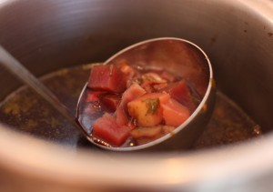

# Cook your CSA: Borscht Recipe

I love Beets! Lots of people say they hate beets. I wonder why. I suspect it's because I didn't grow up eating them, and had never had them canned. I'm guessing lots of people have only known them from a can. Lucia used to hate beets, now at least likes them a little. If you've been participating in Clover's CSA program, you've been getting red beets from [Winter Moon Roots](http://www.cloverfoodlab.com/winter-moon-roots-csa-at-clover/).

So we thought we'd share our recipe for Borscht. We get tons of feedback at Clover and I'm not sure if any other item we serve gets more of a personal reaction from customers than the Borscht. Mostly they're excited to hear we have Borscht and then after they see it, they say something like, "That's not Borscht!" I get it. It's a very personal thing for them. It has deep connections to culture (parents, grandparents, country, etc.). Borscht is a beet soup from Central and Eastern Europe, served cold or hot, with beef or vegetable stock, blended or chunky, often times with sour cream and dill. There are countless variations (and countless spellings) throughout these countries.

So what I did with the idea of making a Borscht recipe was to take the major ingredients that make Borscht unique and then plugged them into the framework of Clover's soup program. Ayr made sure I included caraway and red cabbage. So we use traditional ingredients, in a way that they fit our operational/recipe/service systems. If you're not so sure about beets or borscht, you should at least give them a shot, then let us know what you think. (I witnessed Lucia eat an entire cup of this stuff yesterday).

> **Borscht - Serves 6**
> 
> ****Ingredients:  
>  ****  
>  2 tsp. vegetable oil  
>  1 tbsp. caraway seed, whole  
>  2 medium red onion  
>  1 clove garlic  
>  1 medium carrot  
>  2 stalk celery  
>  ¼ - ½ head red cabbage  
>  1 each bay leaf  
>  ½ cup red wine  
>  10 sprigs parsley, with stem  
>  5 sprigs thyme, picked  
>  2 large red beets  
>  1 medium potato  
>  1 ½ quart vegetable stock  
>  1 ½ tsp sugar  
>  1 tsp. red wine vinegar  
>  to taste salt

> ****Garnish:****  
>  12 sprigs dill, fresh  
>  2 oz. sour cream

> ****Cooking Method:****  
>  Wash carrots, red cabbage, celery, red beets, potato, parsley and dill.  
>  Peel, then cut onion into medium dice. Peel, then mince the garlic.  
>  Heat a soup pot over medium-low heat.  
>  Add vegetable oil and caraway seeds and allow to toast till fragrant, about 3 minutes.  
>  In the meantime, trim and small dice carrot and celery (optional step - I pick the celery leaves and combine with parsley to chop). Reserve.  
>  Turn heat up to medium, add onion and garlic, then saute, stirring occasionally, for about 10 minutes until lightly caramelized.  
>  Cut cabbage section lengthwise into 1-inch thick pieces. Then cross-cut (widthwise) those pieces into very thin slices (should end up with about thin strips of cabbage about 1-inch long).  
>  Add carrots, celery, cabbage and bay leaf, then saute, about 10 minutes longer, stirring occasionally.  
>  Add red wine & simmer until wine is evaporated, about 5 - 10 minutes. (If not ready to move on, turn burner off.)  
>  Small chop the parsley, celery leaves, and thyme. Reserve.  
>  Medium dice the beets and potatoes. Reserve.  
>  Turn the pot to high, then add chopped herbs, beets, potato and vegetable stock.  
>  Bring to a boil, then reduce to a simmer and simmer for about 35 - 45 minutes, until the beets are tender.  
>  Season with sugar, vinegar and salt to taste.  
>  Taste and adjust seasonings.  
>  ****Garnish:  
>  ****  
>  For Garnish: Small chop the dill, then stir into the sour cream.  
>  Garnish with a dollop of sour cream and chopped dill mixture.

> ******When serving, be sure to stir and scoop from the bottom, to evenly disperse the caraway with all of the portions.**
> 
>
