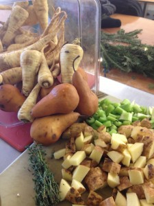

# Winter CSA: Parsnip pear soup

To accompany this week's CSA, I thought it would be a good idea to share the first soup Clover ever made. [Here](http://www.cloverfoodlab.com/?s=pear+parsnip+soup) is a collection of posts about this soup. Take a look at the dates. The first one is dated, the first week we opened back in early Nov 2008. That's neat. Clover soup kits are a bit larger these days.

Minnie made this soup today at the HUB and she did a great job. Click the following link for recipe.

> Parsnip Pear Soup - Serves 6
> 
> ****Ingredients:****
> 
>   * 2 tsp. vegetable oil
>   * 1 medium onion
>   * 1 clove garlic
>   * 1 pound parsnips
>   * 1 medium potato
>   * 1.5 quarts vegetable stock (may need more after blending)
>   * 1 each bay leaf
>   * 2 sprigs thyme, fresh (or 1 pinch dried)
>   * ½ pound pears, ripe (Bartlett or Bosc)
>   * ½ cup half-and-half (optional)
>   * to taste salt
>   * to taste sugar
>   * 1 - 2 tsp. white wine or cider vinegar (not distilled)
> 

> 
> ****Garnish: (optional)****
> 
>   * 1 - 2 each parsnips
>   * 4 sprigs thyme, fresh
> 

> 
> ****Cooking Method:****
> 
>   * Medium chop the onion.
>   * Slice the garlic cloves.
>   * Wash, trim (but do not peel) and rough chop the parsnips and potatoes.
>   * Wash (but do not peel), core and rough chop the pears.
>   * Heat a soup pot over low heat.
>   * Add vegetable oil and onions then sweat for 10 minutes (being sure not to brown).
>   * Add parsnips, potato, vegetable stock and bay leaf then bring to a boil. Turn down to a simmer and stir occasionally.
>   * When parsnips are tender (30 minutes), add pears and half & half then simmer for an additional 15 minutes.
>   * Remove bay leaves and blend in batches until super smooth (about 1 minute on high). If you use a stick blender, it will take longer (3 - 5 minutes).
>   * If necessary, use additional vegetable stock, to adjust to a medium viscosity, then taste and adjust seasoning.
>   * Season to taste with salt, sugar, and vinegar.
>   * Serve garnished with parsnip crisps and thyme leaves.
> 

> 
> ****Garnish Method:****
> 
>   * Wash & peel entire parsnip(s) into strips, using a vegetable peeler.
>   * Fry at 300°F, stirring occasionally, until stops bubbling and crispy (about 4 -6 minutes) – drain on paper towel & salt.
>   * Pick thyme leaves and reserve in a covered container.
>
